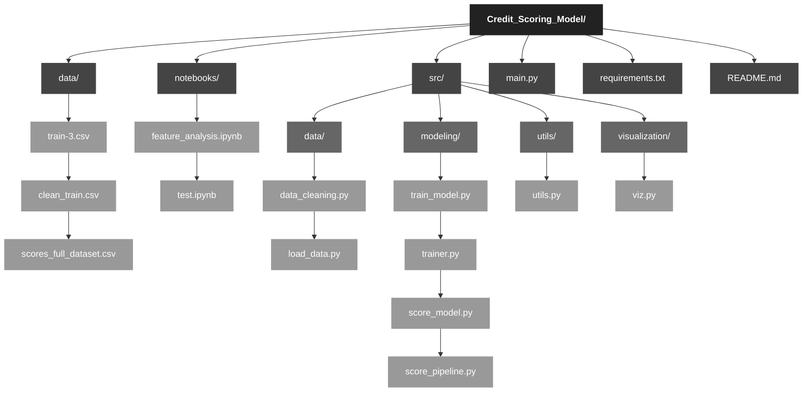
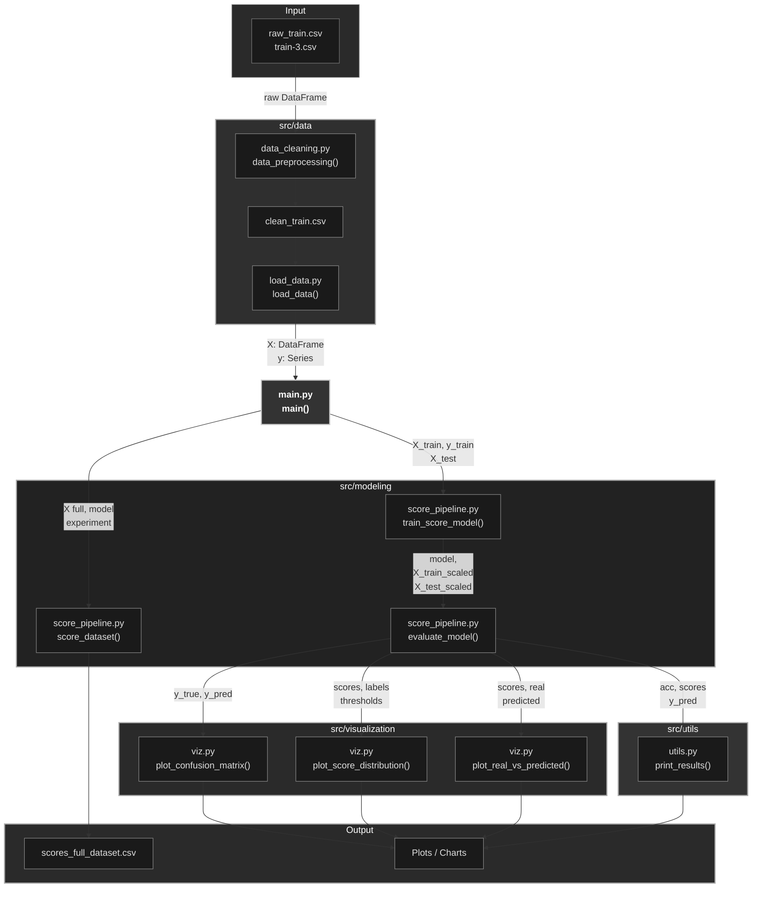
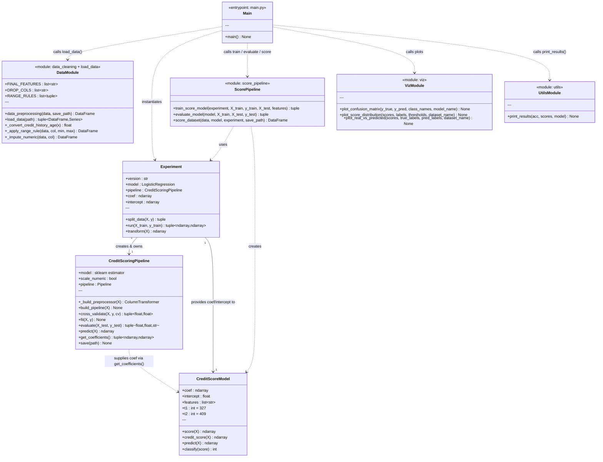

# Credit Scoring Model
### Credit Models project

**Author:** 
  - José Armando Melchor Soto
  - Rolando Fortanell Canedo
  - David Campos Ambriz

**Course:** Credit Models  
**Institution:** ITESO  

---

## Table of Contents

- [Overview](#overview)
- [Project Structure](#project-structure)
- [Architecture](#architecture)
  - [Functional Architecture](#functional-architecture)
  - [OOP Architecture](#oop-architecture)
- [Installation](#installation)
- [Usage](#usage)
- [Pipeline Details](#pipeline-details)
  - [1. Data Preprocessing](#1-data-preprocessing)
  - [2. Feature Set](#2-feature-set)
  - [3. Model Training](#3-model-training)
  - [4. Credit Scoring](#4-credit-scoring)
  - [5. Evaluation & Visualization](#5-evaluation--visualization)
- [Output](#output)
- [License](#license)

---

## Overview

The **Credit Scoring Model** transforms raw consumer credit data into interpretable credit scores and risk categories. The end-to-end workflow covers:

1. **Data cleaning** – removes PII columns, strips noise, imputes missing values, and enforces logical ranges.
2. **Feature engineering** – one-hot encodes categoricals and selects the nine most predictive features.
3. **Model training** – fits a balanced `LogisticRegression` inside a `StandardScaler` → model `sklearn` Pipeline.
4. **Scorecard construction** – derives a linear scorecard from the difference between the "Good" and "Poor" logit coefficients.
5. **Scoring & classification** – rescales the linear score to 0–500 and classifies each record as *Poor*, *Standard*, or *Good* using fixed thresholds.
6. **Visualizations** – generates confusion matrices, score-distribution plots, and real-vs-predicted KDE charts.

---


## Architecture

### Project Structure




### Functional Architecture

Data-flow from raw CSV to scored output:



### Object-Oriented Architecture

Class diagram showing all components and their relationships:



---

## Installation

```bash
# 1. Clone the repository
git clone https://github.com/ppmelch/Credit_Scoring_Model.git
cd Credit_Scoring_Model

# 2. Create and activate a virtual environment (recommended)
python -m venv .venv
source .venv/bin/activate      # macOS / Linux
.venv\Scripts\activate         # Windows

# 3. Install dependencies
pip install -r requirements.txt
```

---

## Usage

### Step 1 – Preprocess the raw data

Run this once to generate `data/clean_train.csv` from the raw file:

```python
import pandas as pd
from src.data.data_cleaning import data_preprocessing

raw = pd.read_csv("data/train-3.csv")
data_preprocessing(raw, save_path="data/clean_train.csv")
```

### Step 2 – Train, evaluate and score

```bash
python main.py
```

`main.py` will:
- Load `data/clean_train.csv`
- Train a logistic-regression scorecard
- Print accuracy and threshold information
- Display confusion matrices and distribution plots
- Save full-dataset scores to `data/scores_full_dataset.csv`

---

## Pipeline Details

### 1. Data Preprocessing

`src/data/data_cleaning.py` – `data_preprocessing()`

| Step | Description |
|------|-------------|
| Drop PII columns | Removes `ID`, `Customer_ID`, `Month`, `Name`, `SSN` |
| Strip noise | Removes `_` and `!@9#%8` patterns via regex |
| Numeric conversion | Strips non-numeric characters from noisy float fields |
| Credit History Age | Converts `"22 Years and 3 Months"` → `22.25` |
| Categorical imputation | Fills missing values in `Credit_Mix`, `Occupation`, `Type_of_Loan`, `Payment_Behaviour` with `"Missing"` |
| Range validation | Flags and nullifies out-of-range values (e.g. `Age` must be 18–100) |
| Numeric imputation | Fills remaining NaN values with the column median; adds `_missing` indicator columns |
| Normalize categories | Converts `"NM"` in `Payment_of_Min_Amount` to `"No"` |

### 2. Feature Set

Nine features are used for modeling (selected after one-hot encoding):

| Feature | Type |
|---------|------|
| `Outstanding_Debt` | Numeric |
| `Interest_Rate` | Numeric |
| `Delay_from_due_date` | Numeric |
| `Num_Credit_Card` | Numeric |
| `Changed_Credit_Limit` | Numeric |
| `Total_EMI_per_month` | Numeric |
| `Credit_Mix_Standard` | Dummy |
| `Credit_Mix_Good` | Dummy |
| `Payment_of_Min_Amount_Yes` | Dummy |

### 3. Model Training

`src/modeling/trainer.py` – `Experiment`  
`src/modeling/train_model.py` – `CreditScoringPipeline`

- An 80/20 **stratified train–test split** is applied.
- A `StandardScaler → LogisticRegression` sklearn `Pipeline` is fitted.
- `LogisticRegression` uses `class_weight="balanced"` and `max_iter=10000`.
- The scorecard coefficients are derived as:

  ```
  coef_score  = coef[Good]  − coef[Poor]
  intercept_score = intercept[Good] − intercept[Poor]
  ```

### 4. Credit Scoring

`src/modeling/score_model.py` – `CreditScoreModel`

The linear score is computed and min-max normalized to 0–500:

```
z     = X · coef_score + intercept_score
score = (z − z_min) / (z_max − z_min) × 500
```

Classification thresholds (scores are integers):

| Score range | Category | Condition |
|-------------|----------|-----------|
| 0 – 326 | **Poor** (class 0) | `score < 327` |
| 327 – 408 | **Standard** (class 1) | `327 ≤ score < 409` |
| 409 – 500 | **Good** (class 2) | `score ≥ 409` |

### 5. Evaluation & Visualization

`src/modeling/score_pipeline.py` – `evaluate_model()`  
`src/visualization/viz.py`

- **Confusion matrices** for train and test sets.
- **Score-distribution KDE plots** (overall and per class) with threshold markers.
- **Real vs. Predicted KDE plots** per credit category.

---

## Output

After running `main.py`, the file `data/scores_full_dataset.csv` is created with three columns:

| Column | Description |
|--------|-------------|
| `Score` | Normalized credit score (0–500) |
| `Classification` | Numeric class label (0, 1, 2) |
| `Credit_Category` | Human-readable label (`Poor`, `Standard`, `Good`) |

---

## About the Author

This repository was created by 
- **José Armando Melchor Soto**
- **Rolando Fortanell Canedo**
- **David Campos Ambriz** 

---
## License

This project is licensed under the **MIT License** - [LICENSE](LICENSE). 
