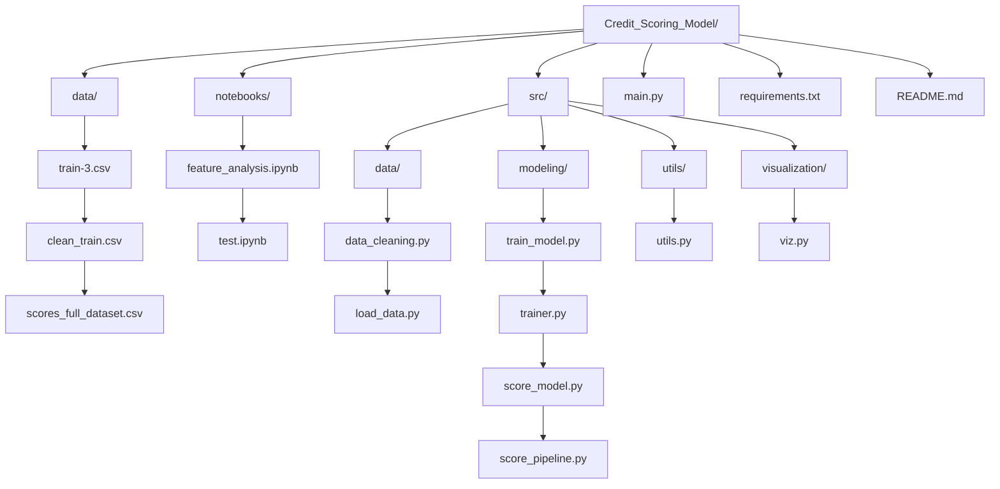
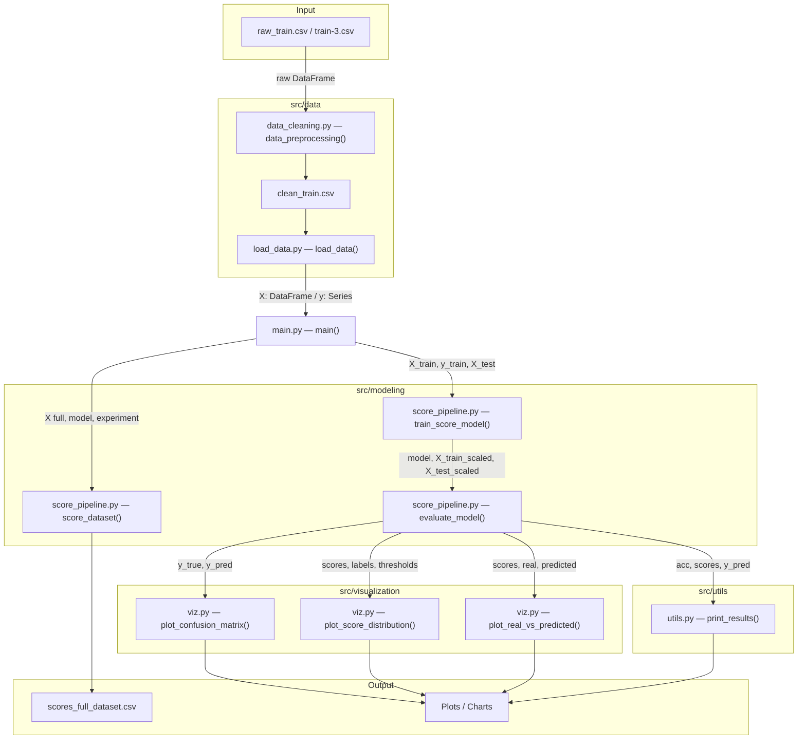
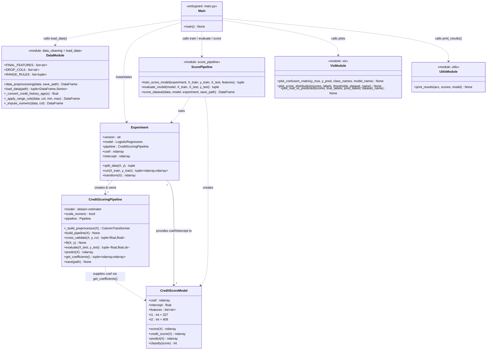

# Credit Scoring Model
### Credit Models project

**Author:** 
  - José Armando Melchor Soto
  - Rolando Fortanell Canedo
  - David Campos Ambriz

**Course:** Credit Models  
**Institution:** ITESO  

---

## Table of Contents

- [Overview](#overview)
- [Project Structure](#project-structure)
- [Architecture](#architecture)
  - [Functional Architecture](#functional-architecture)
  - [OOP Architecture](#oop-architecture)
- [Installation](#installation)
- [Usage](#usage)
- [Pipeline Details](#pipeline-details)
  - [1. Data Preprocessing](#1-data-preprocessing)
  - [2. Feature Analysis](#2-feature-analysis)
  - [3. Feature Selection](#3-feature-selection)
  - [4. Model Training](#4-model-training)
  - [5. Credit Scoring](#5-credit-scoring)
  - [6. Evaluation & Visualization](#6-evaluation--visualization)
- [Results](#results)
- [Discussion](#discussion)
- [Assumptions](#assumptions)
- [Limitations](#limitations)
- [Conclusions](#conclusions)
- [Output](#output)
- [License](#license)

---

## Overview

The **Credit Scoring Model** transforms raw consumer credit data into interpretable credit scores and risk categories. The project addresses a supervised multiclass classification problem, mapping individual financial profiles into one of three ordinal categories: **Poor**, **Standard**, and **Good**.

The end-to-end workflow covers:

1. **Data cleaning** — removes PII columns, strips textual noise, imputes missing values, and enforces logical range constraints.
2. **Feature analysis** — applies correlation analysis, XGBoost-based feature importance, and SHAP values to identify and justify the final predictors.
3. **Feature selection** — nine variables are selected based on statistical relevance and economic interpretability.
4. **Model training** — fits a balanced `LogisticRegression` inside a `StandardScaler` → model `sklearn` Pipeline.
5. **Scorecard construction** — derives a linear scorecard from the difference between the "Good" and "Poor" logit coefficients.
6. **Scoring & classification** — rescales the linear score to 0–500 and classifies each record as *Poor*, *Standard*, or *Good* using fixed thresholds.
7. **Visualizations** — generates confusion matrices, score-distribution plots, and real-vs-predicted KDE charts.

---

## Architecture

### Project Structure



### Functional Architecture

Data-flow from raw CSV to scored output:



### OOP Architecture

Class diagram showing all components and their relationships:



---

## Installation

```bash
# 1. Clone the repository
git clone https://github.com/ppmelch/Credit_Scoring_Model.git
cd Credit_Scoring_Model

# 2. Create and activate a virtual environment
python -m venv .venv
source .venv/bin/activate      # macOS / Linux
.venv\Scripts\activate         # Windows

# 3. Install dependencies
pip install -r requirements.txt
```

---

## Usage

### Step 1 — Preprocess the raw data

Run this once to generate `data/clean_train.csv` from the raw file:

```python
import pandas as pd
from src.data.data_cleaning import data_preprocessing

raw = pd.read_csv("data/train-3.csv")
data_preprocessing(raw, save_path="data/clean_train.csv")
```

### Step 2 — Train, evaluate, and score

```bash
python main.py
```

`main.py` will:
- Load `data/clean_train.csv`
- Split data into train/test sets (80/20 stratified)
- Train a logistic-regression-based scorecard
- Print accuracy and threshold information
- Display confusion matrices and distribution plots
- Save full-dataset scores to `data/scores_full_dataset.csv`

---

## Pipeline Details

### 1. Data Preprocessing

`src/data/data_cleaning.py` — `data_preprocessing()`

The preprocessing pipeline was designed with a traceability-oriented approach: every transformation that removes or modifies information generates a corresponding binary indicator column, preserving potentially predictive signals that would otherwise be lost.

| Step | Description |
|------|-------------|
| Drop PII columns | Removes `ID`, `Customer_ID`, `Month`, `Name`, `SSN` |
| Strip noise | Removes `_` and `!@9#%8` patterns via regex |
| Numeric conversion | Strips non-numeric characters from noisy float fields |
| Credit History Age | Converts `"22 Years and 3 Months"` to `22.25` |
| Categorical imputation | Fills missing values in `Credit_Mix`, `Occupation`, `Type_of_Loan`, `Payment_Behaviour` with `"Missing"` |
| Range validation | Flags and nullifies out-of-range values (e.g. `Age` must be 18–100); creates `<variable>_invalid` indicator |
| Numeric imputation | Fills remaining NaN values with the column median; adds `<variable>_missing` indicator columns |
| Normalize categories | Converts `"NM"` in `Payment_of_Min_Amount` to `"No"` |

After preprocessing: **100,000 x 40** — 23 feature columns + 17 binary indicator columns, zero missing values.

Variables with the highest proportion of missing values:

| Variable | Missing Values | % of Total | Strategy Applied |
|----------|---------------|------------|-----------------|
| `Credit_Mix` | 20,195 | 20.20% | "Missing" category |
| `Monthly_Inhand_Salary` | 15,002 | 15.00% | Median imputation |
| `Type_of_Loan` | 11,408 | 11.41% | "Missing" category |
| `Credit_History_Age` | 9,030 | 9.03% | Median imputation |
| `Num_of_Delayed_Payment` | 7,002 | 7.00% | Median imputation |
| `Amount_invested_monthly` | 4,479 | 4.48% | Median imputation |
| `Num_Credit_Inquiries` | 1,965 | 1.97% | Median imputation |
| `Monthly_Balance` | 1,200 | 1.20% | Median imputation |

### 2. Feature Analysis

To avoid purely statistical variable selection, three complementary analytical stages were applied:

**Correlation analysis** — covariance and correlation matrices were computed across all variables to identify redundant predictors and assess linear independence prior to modeling.

**XGBoost feature importance** — an XGBoost classifier (1,000 estimators, `learning_rate=0.05`, `max_depth=6`) was trained to quantify information gain per variable. The top predictors by gain were: `Credit_Mix_Good`, `Credit_Mix_Standard`, `Payment_of_Min_Amount_Yes`, `Outstanding_Debt`, `Interest_Rate`, `Num_Credit_Card`, `Delay_from_due_date`, `Total_EMI_per_month`, and `Changed_Credit_Limit`.

**SHAP analysis** — Shapley Additive Explanations were computed to confirm the direction and magnitude of each predictor's impact across the three credit categories. Key findings:
- `Outstanding_Debt` and `Delay_from_due_date` exhibit an inverse relationship with financial solvency — higher values increase probability of belonging to the *Poor* class.
- `Credit_Mix_Good` has a strong positive contribution to the *Good* classification.
- `Payment_of_Min_Amount_Yes` shows a negative contribution to higher-risk classifications within the *Good* group.

### 3. Feature Selection

Nine features were selected based on statistical relevance, SHAP-confirmed directionality, and economic interpretability across three conceptual pillars:

**Repayment capacity and leverage level**
- `Outstanding_Debt` — total outstanding debt constrains consumer liquidity and signals financial stress.
- `Total_EMI_per_month` — high monthly installment load reduces capacity to absorb unexpected shocks.

**Payment behavior and credit history**
- `Delay_from_due_date` — average days past due; a robust early warning signal for default risk.
- `Payment_of_Min_Amount_Yes` — consistent minimum-only payments indicate short-term liquidity pressure.

**Customer conditions and risk perception**
- `Credit_Mix_Standard`, `Credit_Mix_Good` — credit portfolio diversification as a signal of financial discipline.
- `Interest_Rate` — risk-based pricing proxy; higher rates reflect prior risk assessment by other institutions.
- `Num_Credit_Card` — potential indicator of structural reliance on revolving credit.
- `Changed_Credit_Limit` — captures institutional reassessments of the borrower's repayment capacity.

### 4. Model Training

`src/modeling/trainer.py` — `Experiment` / `src/modeling/train_model.py` — `CreditScoringPipeline`

- **80/20 stratified train-test split** to preserve class distribution.
- `StandardScaler` applied within a unified `sklearn` Pipeline.
- `LogisticRegression` with `class_weight="balanced"` and `max_iter=10000` to address class imbalance.
- Scorecard coefficients derived as the difference between class logits:

```
coef_score      = coef[Good]      - coef[Poor]
intercept_score = intercept[Good] - intercept[Poor]
```

### 5. Credit Scoring

`src/modeling/score_model.py` — `CreditScoreModel`

The linear score is defined as:

```
z = X · coef_score + intercept_score
```

This is equivalent to the difference between the *Good* and *Poor* logits, preserving the linear structure of traditional credit scorecards while capturing the relative separation between risk profiles. The raw score is then min-max normalized to a 0–500 scale:

```
score = (z - z_min) / (z_max - z_min) * 500
```

Classification thresholds:

| Score Range | Category | Condition |
|-------------|----------|-----------|
| 0 – 326 | **Poor** (class 0) | `score < 327` |
| 327 – 408 | **Standard** (class 1) | `327 <= score < 409` |
| 409 – 500 | **Good** (class 2) | `score >= 409` |

### 6. Evaluation & Visualization

`src/modeling/score_pipeline.py` — `evaluate_model()` / `src/visualization/viz.py`

- **Confusion matrices** for train and test sets.
- **Score-distribution KDE plots** (overall and per class) with threshold markers at `t1` and `t2`.
- **Real vs. Predicted KDE plots** per credit category to assess distributional alignment.

---

## Results

The model achieved a **test accuracy of 62.3%**, correctly classifying approximately 62,300 out of 100,000 records into their corresponding credit risk category.

### Class Distribution of the Target Variable

| Class | Frequency | Proportion |
|-------|-----------|------------|
| Standard (majority) | 53,174 | 53.17% |
| Poor | 28,998 | 29.00% |
| Good (minority) | 17,828 | 17.83% |

The dataset exhibits moderate class imbalance, which was addressed via `class_weight="balanced"` during model training.

### Confusion Matrix — Test Set

|  | Predicted Poor | Predicted Standard | Predicted Good |
|--|----------------|-------------------|----------------|
| **True Poor** | 3,943 | 1,287 | 569 |
| **True Standard** | 2,548 | 6,049 | 2,038 |
| **True Good** | 101 | 997 | 2,468 |

### Key Observations

- The model correctly identifies the majority of *Standard* observations, consistent with this class representing over half the dataset.
- The *Good* class achieves strong separation, with most observations concentrated above threshold `t2 = 409`.
- The primary source of misclassification occurs between *Poor* and *Standard*, reflecting overlapping financial profiles near `t1 = 327`.
- **Type I error is effectively limited**: very few *Poor* borrowers (569 out of 5,799 test records) are misclassified as *Good*, the most costly error in a credit decision context.

### Score Distribution

In both training and test sets, the score distributions preserve a consistent ordering:
- *Poor* class concentrates below `t1`
- *Standard* occupies the intermediate region between `t1` and `t2`
- *Good* class is clearly shifted toward higher scores, above `t2`

The predicted distributions closely follow the real distributions in shape and ordering across all three classes, indicating that the scoring function generalizes reasonably well to unseen data.

---

## Discussion

The 62.3% accuracy obtained represents a sound baseline for a linear model applied to a moderately imbalanced multiclass problem. The result is intentionally conservative — the project prioritizes **interpretability and economic justification** over raw predictive power.

For context, an experimental XGBoost model trained during the feature analysis phase achieved accuracy above 80%, successfully capturing non-linear relationships between variables. However, this gain in performance comes at the cost of interpretability: ensemble methods do not naturally translate into the linear scorecard format required for transparent credit decision-making under regulatory frameworks such as the Basel Committee guidelines.

The confusion matrix confirms that the model's misclassification profile is operationally appropriate: the most critical error — classifying a *Poor* borrower as *Good* and incorrectly extending credit — is kept to a minimum. Misclassifications are predominantly between adjacent risk categories (*Poor* vs. *Standard*), which carry substantially lower financial consequences.

The classification thresholds (`t1 = 327`, `t2 = 409`) were set by analyzing the intersection of class score distributions. In a production environment, these thresholds would be calibrated dynamically based on the institution's risk appetite, cost-of-default estimates, and portfolio objectives.

---

## Assumptions

The model was developed under the following assumptions:

**Statistical assumptions** — logistic regression assumes a linear relationship between the selected variables and the log-odds of class membership. Variable independence was assessed through correlation matrix analysis prior to feature selection. Observations are assumed to be independent of one another.

**Economic assumptions** — the model assumes that a borrower's current financial behavior is a valid predictor of future solvency, under stable macroeconomic conditions. External shocks such as recessions or systemic credit events are not captured.

**Behavioral assumptions** — the borrower is assumed to be rational and to act consistently with their financial obligations. The model captures deteriorating payment discipline (delayed payments, minimum-only payments, reliance on multiple credit lines) as early warning signals of default risk.

---

## Limitations

**Static economic environment** — the model cannot adapt to macroeconomic fluctuations. A significant external event may require a complete reformulation of the model and its input variables.

**Linear structure** — the choice of logistic regression sacrifices the ability to capture non-linear interactions between variables. The experimental XGBoost model demonstrated that substantial predictive power remains unexplained by linear combinations alone.

**Fixed classification thresholds** — the thresholds `t1` and `t2` were determined empirically by analyzing class score distributions. In practice, optimal cutoff points should be determined dynamically based on institutional cost functions and regulatory requirements.

**Data quality dependency** — the model's reliability is constrained by the quality of the input data. The dataset contained significant noise and missing values in several key variables; while the preprocessing pipeline handles these systematically, the manual correction process may have introduced constraints on final performance.

---

## Conclusions

This project demonstrates that a transparent, interpretable credit scoring model can be constructed from a logistic regression framework without sacrificing operational soundness. The final model correctly classifies 62.3% of borrowers and effectively restricts the most costly misclassification error — approving credit for high-risk applicants.

The feature selection process, supported by XGBoost importance metrics and SHAP analysis, produced a parsimonious set of nine predictors with clear economic justification across three conceptual dimensions: repayment capacity, payment behavior, and institutional risk perception. This grounding in financial theory ensures that the model's outputs are auditable and interpretable by domain experts.

The scoring function — derived as the difference between the *Good* and *Poor* logits and normalized to a 0–500 scale — provides a continuous risk metric that can be directly integrated into credit decision workflows. The score distributions across both training and test sets demonstrate that the model generalizes consistently to unseen data.

Future improvements may include threshold optimization via cost-sensitive analysis, exploration of ordinal regression methods that explicitly leverage the ordered structure of the target variable, and the introduction of time-varying features to better capture dynamic changes in borrower behavior.

---

## Output

After running `main.py`, the file `data/scores_full_dataset.csv` is created with three columns:

| Column | Description |
|--------|-------------|
| `Score` | Normalized credit score (0–500) |
| `Classification` | Numeric class label (0, 1, 2) |
| `Credit_Category` | Human-readable label (`Poor`, `Standard`, `Good`) |

---

## Documentation

The full project report is available at:

- [Credit Scoring Report](docs/Credit_Scoring_Model.pdf)

---

## License

This project is licensed under the **MIT License** — see [LICENSE](LICENSE) for details.